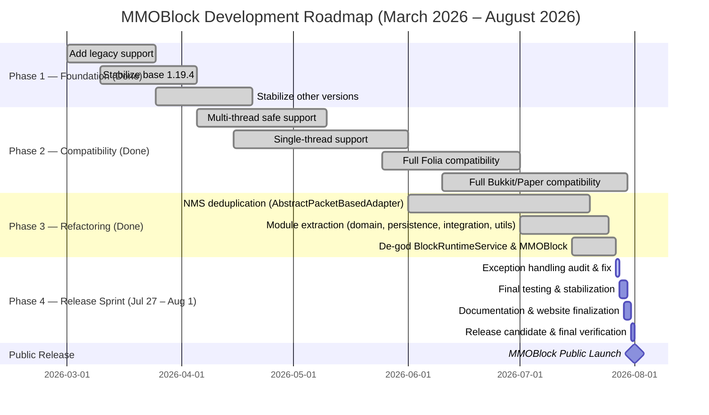

<div align="center">
  

### MMOBlock
### *Unblock the Fun, One Click at a Time.*

[](https://github.com/Rosaaalfi/MMOBlock-Rework/actions)
[](https://www.codefactor.io/repository/github/rosaaalfi/mmoblock-rework/overview/main)
[](https://github.com/Rosaaalfi/MMOBlock-Rework/issues)
[](https://repo.chyxelmc.me)

</div>

---

## About

**MMOBlock** is a modular Minecraft plugin designed for modern **Paper-based servers** and compatible server software such as **Folia**.

The project focuses on:

| Goal                     | Description                                     |
|--------------------------|-------------------------------------------------|
| **Cross-version**        | Supports Minecraft 1.19.4 through 26.2 seamlessly |
| **Modular Architecture** | 9 independent modules for scalability & maintainability |
| **Thread-safe Systems**  | Full Folia & Paper multi-thread safety          |
| **Performance**          | Packet-based rendering, Caffeine caching, ECS-driven state |
| **Extensible API**       | Developer-friendly API for integrations         |
| **Plugin Integrations**  | PlaceholderAPI, ModelEngine, BetterModel, ItemsAdder, CraftEngine, MMOItems, MMOCore |

---

## Repository Structure

```
MMOBlock-Rework/
 ├── mmoblock-api/             → Public API contracts for third-party developers
 ├── mmoblock-domain/          → Shared domain models (BlockDefinitionModel, PlacedBlockModel, etc.)
 ├── mmoblock-ecs/             → Pure ECS (Entity Component System) core engine (zero dependencies)
 ├── mmoblock-integration/     → Third-party plugin compatibility layer (ModelEngine, MMOItems, etc.)
 ├── mmoblock-nms/             → NMS compatibility umbrella
 │   ├── nms-common/           →   Shared NMS abstractions (AbstractPacketBasedNmsAdapter, FakeBlockPacketHandler base, ColorResolver, schematic parser)
 │   ├── nms-v1_21_1/          →   Minecraft 1.21.1 (Mojang-mapped)
 │   ├── nms-v1_21_4/          →   Minecraft 1.21.4 (Mojang-mapped)
 │   ├── nms-v1_21_11/         →   Minecraft 1.21.11 (Mojang-mapped)
 │   ├── nms-v26_1/            →   Minecraft 26.1 (Mojang-mapped)
 │   ├── nms-v26_2/            →   Minecraft 26.2 (Mojang-mapped)
 │   ├── nms-mojang-v1_19_4/   →   Minecraft 1.19.4 (Mojang-mapped)
 │   ├── nms-mojang-v1_20_4/   →   Minecraft 1.20.4 (Mojang-mapped)
 │   ├── nms-spigot-v1_19_4/   →   Minecraft 1.19.4 (Spigot/obfuscated)
 │   └── nms-spigot-v1_20_4/   →   Minecraft 1.20.4 (Spigot/obfuscated)
 ├── mmoblock-persistence/     → Database & caching layer (H2/MySQL, HikariCP, Caffeine)
 ├── mmoblock-platform/        → Thread-safe scheduler abstraction
 │   ├── platform-api/         →   Shared scheduler interface
 │   ├── platform-paper/       →   Paper-specific scheduler
 │   └── platform-folia/       →   Folia-specific scheduler
 ├── mmoblock-plugin/          → Main plugin logic, ECS systems, runtime, commands, listeners
 ├── mmoblock-utils/           → Shared utilities (logger, dependency checker, color utilities)
 └── docs/                     → Static project page & consumer documentation
```

> 💡 NMS adapters leverage shared code in `nms-common` via `AbstractPacketBasedNmsAdapter`, reducing ~80% of version-specific duplication. Each adapter only provides version-specific factory hooks.

---

## Features

<details>
<summary><strong>Click to expand feature list</strong></summary>

### Configuration
- **Block definitions** — YAML-based with item, respawn, mining, visual, drop, and condition sections
- **Node definitions** — Multi-block resource nodes with block composition and hologram display
- **Drop tables** — Customizable with MATERIAL, EXPERIENCE (vanilla/MMOCore), and COMMAND types
- **Tool mechanics** — Click actions, durability handling, drop filtering
- **Language system** — Full localization support (en-us, id-id, ja-jp, zh-cn, zh-tw)

### Block & Node System
- Custom block placement with facing direction
- Multi-block **Node** system (resource node clusters)
- Per-player mining progress & throttling
- Look-protection (prevent interaction through walls)
- Chunk lifecycle management (load/unload)
- Random location resolver with safety checks (grounded, hemmed-in, proximity)

### Visual Systems
- **Fake blocks** — Packet-level block replacement (visible only to specific players)
- **Packet holograms** — TEXT, ITEM, and BLOCK display lines with per-player rendering
- **Schematics** — Sponge-format `.schem` loading with normal/dead states
- **BdEngine** — Custom `.bdengine` model format with multi-part displays, collision lists, and animations
- **ModelEngine** — Third-party model attachment with barrier collision
- **Hologram animations** — Wave, color cycle, typewriter, burn effects via `<anim:...>` tags
- **Break animation** — Client-side block break stage packets

### Drop System
- Drop types: `inventory`, `frontGround`, `centerGround`
- Per-player drops with visual exclusivity
- Explosion velocity, beam particles, colored glow effects (including rainbow)
- **Drop popups** — Floating text notifications via packet holograms
- Custom drop chances and quantity ranges

### Performance
- **ECS-driven** state management (EntityManager, SystemManager, custom components)
- **Packet-based** rendering (minimizes server-side entity overhead)
- **Caffeine** caching for persistence layer
- **Structural hologram matching** — Fast path avoids re-allocation when only text changes
- **Folia-compatible** — Region-aware thread safety throughout

### Integrations
- **PlaceholderAPI** — Full placeholder resolution (`%mmoblock_progress%`, etc.)
- **ModelEngine** — Model attachment for custom blocks
- **BetterModel** — Cross-plugin model compatibility
- **ItemsAdder** — Custom item resolution
- **CraftEngine** — Model & item compatibility
- **MMOItems** — Custom item integration
- **MMOCore** — Experience, skill, and level bridging

### Backend
- **Dual database** — H2 (embedded) or MySQL (production) via HikariCP connection pooling
- **Dependency autoloading** — Runtime library download from Maven Central with SHA-256 verification
- **bStats** — Anonymous usage statistics
- **Auto-update checker**

</details>

---

## Development Roadmap

> Public Release Target: **August 1, 2026** — Accelerated from original June 2027 schedule



### Release Sprint Breakdown

| Day | Date | Focus |
|-----|------|-------|
| Day 1 | Jul 27 | Exception handling audit fixes (see [Phase 5 report](docs/phase5-exception-audit-report.md)) |
| Day 2 | Jul 28 | Critical bug fixes & final integration testing |
| Day 3 | Jul 29 | Cross-version testing (1.19.4 -- 26.2) & platform testing (Paper/Folia) |
| Day 4 | Jul 30 | Documentation finalization & website deployment |
| Day 5 | Jul 31 | Release candidate build, performance benchmark, final verification |
| **Aug 1** | **PUBLIC RELEASE** |

### Completed Items

| Item | Status |
|------|--------|
| 9-module modular architecture | Done |
| NMS deduplication (~80% code duplication reduction) | Done |
| Module extraction (domain, persistence, integration, utils) | Done |
| De-god BlockRuntimeService & MMOBlock | Done |
| MMOItems & MMOCore integration | Done |
| CraftEngine, ItemsAdder, ModelEngine, BetterModel integration | Done |
| PlaceholderAPI expansion | Done |
| Custom logger, drop popups, hologram animations | Done |
| Exception handling audit (117 silent exceptions identified) | Done |
| Background hologram transparency fix (1.20.4 Spigot/Folia) | Done |
| Comprehensive testing guide | Done |
| 1.20.4 Mojang & Spigot (Paper/Folia) testing | Done |
| RC build & final verification | In Progress |
| **Public Release** | **August 1, 2026** |

---

## Quick Start

### 1. Build

```bash
./gradlew build
```

### 2. Install

Copy the generated `.jar` into your server's plugin folder:

```
server/
└── plugins/
    └── MMOBlock.jar   ← here
```

### 3. Configure

Edit your settings under:

```
plugins/MMOBlock/
├── blocks/      → Block definitions (YAML)
├── drops/       → Drop tables (YAML)
├── tools/       → Tool configurations (YAML)
├── nodes/       → Node definitions (YAML)
├── lang/        → Language files (YAML — en-us, id-id, ja-jp, zh-cn, zh-tw)
└── models/      → 3D model files
    ├── bdengine/     → .bdengine model files
    └── schematics/   → .schem schematic files (normal/ & dead/ subdirectories)
```

> 💡 Default configuration files are automatically extracted on first run.

---

## Dependency

MMOBlock API artifacts are published to **Chyxel Repository**. Repository docs and browsing live at <https://repo.chyxelmc.me/>, while Maven artifacts are served from:

```
https://repo.chyxelmc.me/repository
```

### Gradle (Kotlin DSL)

```kotlin
repositories {
    maven("https://repo.chyxelmc.me/repository")
}

dependencies {
    implementation("me.chyxelmc:mmoblock-api:{version}")
}
```

### Maven

```xml
<repositories>
    <repository>
        <id>chyxel-repo</id>
        <url>https://repo.chyxelmc.me/repository</url>
    </repository>
</repositories>

<dependencies>
    <dependency>
        <groupId>me.chyxelmc</groupId>
        <artifactId>mmoblock-api</artifactId>
        <version>{version}</version>
    </dependency>
</dependencies>
```

---

## API Examples

### Place a Block

```java
MMOBlockApi api = MMOBlockApi.get();

if (api != null) {
    api.getBlockService().placeBlock(
        "exampleEntity",
        Bukkit.getWorlds().get(0),
        100, 64, 100,
        "north"
    );
}
```

### Place a Node

```java
MMOBlockApi api = MMOBlockApi.get();

if (api != null) {
    api.getNodeService().placeNode(
        "iron_node",
        Bukkit.getWorlds().get(0),
        100, 64, 100,
        "north"
    );
}
```

### Listen to Events

```java
@EventHandler
public void onBlockMine(BlockMineEvent e) {
    if (e.isCompleted()) {
        e.getPlayer().sendMessage(
            "You finished mining: " + e.getDefinition().getId()
        );
    }
}
```

---

## Contributing

1. Use `mmoblock-api` for all API access — avoid touching internals
2. Domain models should go into `mmoblock-domain`, persistence into `mmoblock-persistence`, integrations into `mmoblock-integration`
3. Add new NMS versions by implementing only the required factory hooks in `AbstractPacketBasedNmsAdapter` — the common packet logic is already in `nms-common`
4. Register your `NmsAdapter` implementations properly via `ServiceLoader` (see existing adapters for reference)
5. ECS work should use `EntityManager` directly within tick systems; submit asynchronous work through the scheduler abstraction
6. Implement NMS features supporting the oldest Minecraft version first (1.19.4), then port forward
7. Use the `platform-api` `Scheduler` for all async/region-aware tasks instead of Bukkit schedulers directly
8. Run tests before opening a pull request
9. Follow existing code style and module structure

---

## License & Support

- **Website:** [chyxelmc.me](https://chyxelmc.me)
- **Issues:** [GitHub Issues](https://github.com/Rosaaalfi/MMOBlock-Rework/issues)

---

<div align="center">

❤️ **Thanks for using MMOBlock!**

</div>
