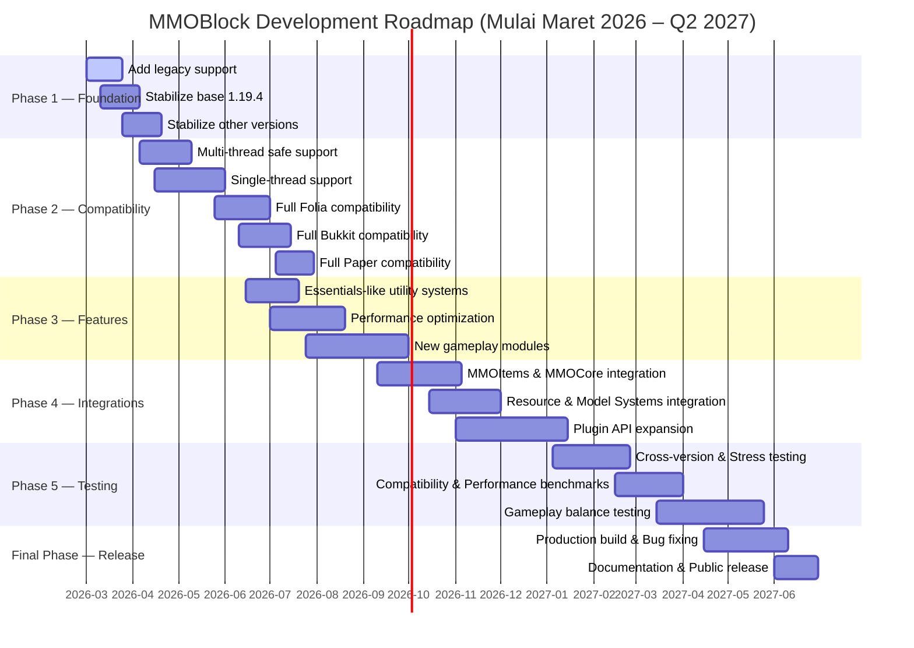

<div align="center">
  

### MMOBlock
### *Unblock the Fun, One Click at a Time.*
#
###
[](https://github.com/Rosaaalfi/MMOBlock-Rework/actions)
[](https://app.codacy.com/gh/Rosaaalfi/MMOBlock-Rework/dashboard?utm_source=gh&utm_medium=referral&utm_content=&utm_campaign=Badge_grade)
[](https://github.com/Rosaaalfi/MMOBlock-Rework/issues)
[](https://repo.chyxelmc.me)

</div>

---

## About

**MMOBlock** is a modular Minecraft plugin designed for modern **Paper-based servers** and compatible server software such as **Folia**.

The project focuses on:

| Goal                     | Description                                     |
|--------------------------|-------------------------------------------------|
| **Cross-version**        | Supports multiple Minecraft versions seamlessly |
| **Modular Architecture** | Independent modules for scalability             |
| **Thread-safe Systems**  | Full Folia & Paper multi-thread safety          |
| **Performance**          | Optimized for high-load servers                 |
| **Extensible API**       | Developer-friendly API for integrations         |

---

## Repository Structure

```
MMOBlock-Rework/
 ├── mmoblock-api/          → Public API bridge for third-party developers
 ├── mmoblock-ecs/          → ECS (Entity Component System) core engine
 ├── mmoblock-plugin/       → Main gameplay & plugin logic (shadowJar artifact)
 ├── mmoblock-nms/          → NMS compatibility umbrella
 │   ├── nms-common/        →   Internal runtime loader & adapter abstraction
 │   ├── nms-v1_21_1/       →   Minecraft 1.21.1 (Mojang-mapped)
 │   ├── nms-v1_21_4/       →   Minecraft 1.21.4 (Mojang-mapped)
 │   ├── nms-v1_21_11/      →   Minecraft 1.21.11 (Mojang-mapped)
 │   ├── nms-v26_1/         →   Minecraft 26.1 (Mojang-mapped)
 │   ├── nms-v26_2/         →   Minecraft 26.2 (Mojang-mapped)
 │   ├── nms-mojang-v1_19_4/→   Minecraft 1.19.4 (Mojang-mapped)
 │   ├── nms-mojang-v1_20_4/→   Minecraft 1.20.4 (Mojang-mapped)
 │   ├── nms-spigot-v1_19_4/ →   Minecraft 1.19.4 (Spigot/obfuscated)
 │   └── nms-spigot-v1_20_4/ →   Minecraft 1.20.4 (Spigot/obfuscated)
 ├── mmoblock-platform/ → Thread-safe scheduler abstraction
 │   ├── platform-api/  →   Shared scheduler interface
 │   ├── platform-paper/→   Paper-specific scheduler
 │   └── platform-folia/→   Folia-specific scheduler
 ├── docs/              → Static project page & consumer documentation
 ├── server/            → Pre-configured server directories for testing
 └── runClient/         → Local test server instances
```

> 💡 If you are working on a specific Minecraft version, navigate to the corresponding `nms-*` module under `mmoblock-nms/`.

---

## Features

- YAML-based custom block configuration
- Advanced mining systems
- Tool-based mechanics
- Custom rewards & drops
- Hologram support
- Multi-database support (**H2 / MySQL**)
- 3D model integrations
- Cross-version compatibility
- Paper & Folia support
- Developer-friendly API

---

## Development Roadmap


---

## Quick Start

### 1. Build

```bash
./gradlew build
```

### 2. Install

Copy the generated `.jar` into your server's plugin folder:

```
server/
└── plugins/
    └── MMOBlock.jar   ← here
```

### 3. Configure

Edit your settings under:

```
plugins/MMOBlock/
├── blocks/    → Block definitions
├── drops/     → Drop tables
└── tools/     → Tool configurations
```

---

## Dependency

MMOBlock API artifacts are published to **Chyxel Repository**. Repository docs and browsing live at <https://repo.chyxelmc.me/>, while Maven artifacts are served from:

```
https://repo.chyxelmc.me/repository
```

### Gradle (Kotlin DSL)

```kotlin
repositories {
    maven("https://repo.chyxelmc.me/repository")
}

dependencies {
    implementation("me.chyxelmc:mmoblock-api:{version}")
}
```

### Maven

```xml
<repositories>
    <repository>
        <id>chyxel-repo</id>
        <url>https://repo.chyxelmc.me/repository</url>
    </repository>
</repositories>

<dependency>
<groupId>me.chyxelmc</groupId>
<artifactId>mmoblock-api</artifactId>
<version>{version}</version>
</dependency>
```

---

## API Examples

### Place a Block

```java
MMOBlockApi api = MMOBlockApi.get();

if (api != null) {
        api.getBlockService().placeBlock(
        "exampleEntity",
        Bukkit.getWorlds().get(0),
        100, 64, 100,
                "north"
                );
                }
```

### Listen to Events

```java
@EventHandler
public void onBlockMine(BlockMineEvent e) {
    if (e.isCompleted()) {
        e.getPlayer().sendMessage(
                "You finished mining: " + e.getDefinition().getId()
        );
    }
}
```

---

## Contributing

1. Use `mmoblock-api` for all API access — avoid touching internals
2. Register your `NmsAdapter` implementations properly via `ServiceLoader`
3. ECS work should submit `EcsCommand` work to the command queue; systems inside the ECS tick loop may mutate components/entities directly
4. NMS features must be implemented in the oldest supported adapters first (1.19.4), then ported forward
5. Run tests before opening a pull request
6. Follow existing code style and module structure

---

## License & Support

- **Website:** [chyxelmc.me](https://chyxelmc.me)
- **Issues:** [GitHub Issues](https://github.com/Rosaaalfi/MMOBlock-Rework/issues)

---

<div align="center">

❤️ **Thanks for using MMOBlock!**

</div>
